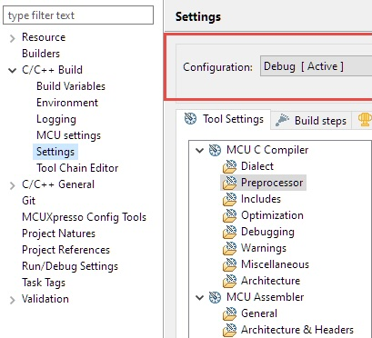
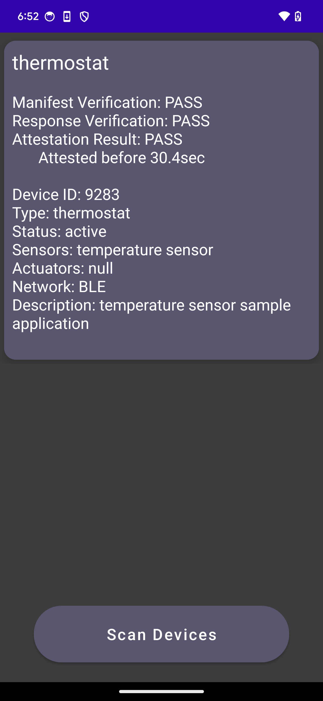

# DB-PAISA: Discovery-Based Privacy-Agile IoT Sensing+Actuation

**DB-PAISA Paper (PETS'25) - [arXiv](https://arxiv.org/pdf/2412.11572)**

Internet of Things (IoT) devices are becoming increasingly commonplace in both public and semi-private settings. Currently, most such devices lack mechanisms that allow for their discovery by casual (nearby) users who are not owners or operators. However, these users are potentially being sensed, and/or actuated upon, by these devices, without their knowledge or consent. This triggers privacy, security, and safety issues.

To address this problem, some recent work explored device transparency in the IoT ecosystem. The intuitive approach is for each device to periodically and securely broadcast (announce) its presence and capabilities to all nearby users. While effective, when no new users are present, this 𝑃𝑢𝑠ℎ-based approach generates a substantial amount of unnecessary network traffic and needlessly interferes with normal device operation.

In this work, we construct DB-PAISA which addresses these issues via a 𝑃𝑢𝑙𝑙-based method, whereby devices reveal their presence and capabilities only upon explicit user request. Each device guarantees a secure timely response (even if fully compromised by malware) based on a small active Root-of-Trust (RoT). DB-PAISA requires no hardware modifications and is suitable for a range of current IoT devices. To demonstrate its feasibility and practicality, we built a fully functional and publicly available prototype. It is implemented atop a commodity MCU (NXP LCP55S69) and operates in tandem with a smartphone-based app. Using this prototype, we evaluate energy consumption and other performance factors.

## DB-PAISA Directory Structure

    DB-PAISA
    ├── 1_IoTDev
    │   ├── 1_NXPBoard
    │   │   ├── freertos_blinky_ns
    │   │   │   ├── drivers
    │   │   │   ├── freertos
    │   │   │   ├── nsc_functions
    │   │   │   ├── source
    │   │   │   └── startup
    │   │   └── freertos_blinky_s
    │   │       ├── include
    │   │       ├── drivers
    │   │       ├── mbedtls
    │   │       ├── nsc_functions
    │   │       ├── source
    │   │       └── startup
    │   └── 2_ESP32-C3
    │       └── main
    └── 2_AndroidPhone/
        └── app
            └── src
                └── main
                    ├── java
                    │   └── com
                    │       └── sprout
                    │           └── db-paisa
                    └── res
                         └── layout

## Hardware and Software Requirement

### Hardware Requirements

#### IoT Device Hardware Requirements
1. [NXP LPC55S69 board](https://www.nxp.com/design/software/development-software/mcuxpresso-software-and-tools-/lpcxpresso-boards/lpcxpresso55s69-development-board:LPC55S69-EVK) (based on Cortex-M33 equiped with Trustzone-M)
2. [ESP32-C3-DevKitC-02 board](https://docs.espressif.com/projects/esp-idf/en/latest/esp32c3/hw-reference/esp32c3/user-guide-devkitc-02.html)

DB-PAISA is primarily working on NXP board ([Digikey Link](https://www.digikey.com/en/products/detail/nxp-usa-inc/LPC55S69-EVK/9865963)), representing an IoT device.
ESP board ([Digikey Link](https://www.digikey.com/en/products/detail/espressif-systems/ESP32-C3-DEVKITC-02/14553009)) is necessary for using BLE, physically connected with NXP board via UART.

#### User Device Hardware Requirements
1. [Google Pixel 6](https://www.gsmarena.com/google_pixel_6-11037.php)
2. [Google Pixel 6 Pro](https://www.gsmarena.com/google_pixel_6_pro-10918.php)

Two Google Pixel phones (Standard and Pro) are used to emulate DB-PAISA user device.
Though we have only tested with the above phones, other Android phones probably can be used instead, as long as they support Bluetooth 5 or later.
See [details](#google-pixel-6-pro) below.

### Software Requirements
Each device requires SDK and development tool.

#### NXP Board Software Requirements
1. IDE: [MCUXpresso IDE v11.6.1](https://www.nxp.com/design/software/development-software/mcuxpresso-software-and-tools-/mcuxpresso-integrated-development-environment-ide:MCUXpresso-IDE) (released on 2022-10-03)
2. SDK: v2.12.0 (released on 2022-07-14)

SDK can be built using [MCUXpresso SDK Builder](https://mcuxpresso.nxp.com/en/welcome), or it can be downloaded via MCUXpresso IDE. 
Note that DB-PAISA implementation on NXP board is based on the secure_gpio example, provided by NXP.

##### Secure Configuration (Trustzone-M)
The following peripherals, memory regions (flash and RAM), interrupts are configured as secure:
- Peripherals
    - CTimer2 - a secure timer
    - FlexComm4 - a secure network peripheral for UART4
    - HashCrypt - a hardware accelerator for SHA256
    - Casper - a hardware accelerator for ECDSA schemes
- Memory
    - RAM - 0x3000_0000 ~ 0x3002_FFFF, 192KB
    - Flash - 0x1000_0000 ~ 0x1003_FDFF, 260KB
- Interrupt
    - CTimer2
    - FlexComm4

For more details about how to use IDE, please refer to [MCUXpresso IDE User Guide](https://community.nxp.com/pwmxy87654/attachments/pwmxy87654/Layerscape/4742/1/MCUXpresso_IDE_User_Guide.pdf).

#### ESP Board Software Requirements
The details about ESP board is described [here](https://docs.espressif.com/projects/esp-idf/en/latest/esp32c3/hw-reference/esp32c3/user-guide-devkitc-02.html).
- IDE: [VSCode Extension for ESP32](https://docs.espressif.com/projects/vscode-esp-idf-extension/en/latest/installation.html), v1.6.1

#### Android Phone Software Requirements
1. IDE: [Android Studio Electric Eel | 2022.1.1](https://developer.android.com/studio/releases/past-releases/as-electric-eel-release-notes) (released in Jan 2023)
2. Android API Level: 32
3. Android OS: Android 12 (released on 2021-10-04)

### Estimated Time and Storage Consumption
Estimated time for compile/flash is not more than 5 minutes for each hardware (NXP, ESP, Android phone).
DB-PAISA execution is also fast; once completing the boot of NXP and ESP boards, run DB-PAISA app in Android, give permissions, and click 'scan' button.
It will show the result within 7 s.

Storage requirement is also small. Their binary size would exceed a few MB.

## Environment 

### Accessibility
The source code is publicly availabe at UCI SPROUT github,
https://github.com/sprout-uci/DB-PAISA

### Set up the environment

#### IoT Device Setup - NXP Board
##### Prerequisite
1. [NXP LPC55S69](#iot-device-hardware-requirements): Power cable should be connected to Debug port (P6, at the bottom of Figure 1).
2. [MCUXpresso IDE v11.6.1](#nxp-board-software-requirements): NXP IDE should be installed.

  

<b>Figure 1 - DB-PAISA hardware connection between NXP board and ESP board</b>

##### Steps

The project for NXP board is composed of two projects, freertos_blinky_ns for Normal world (non-secure) and freertos_blinky_s for Secure world. 
To build binaries running on each world, click each project and click the 'build' button in the following way:

1. binary for Normal world\
        **a.** Click freertos_blinky_ns project.\
        **b.** Click 'build' button in Quickstart pannel located in bottom left, or click 'Project' tab - 'Build Project'.\
        **c.** Click 'LS' on the left of 'Debug your project' in Quickstart pannel, and click 'attach to a running target using LinkServer'.

2. binary for Secure World\
        **a.** Click freertos_blinky_s project.\
        **(Optional, but recommended)** Add definition 'PERFORMANCE_EVALUATION' to preprocessor setup as depicted in Figure 2. This setup is recommended because it can show progress on NXP board once a request message is received.\
        **b.** Click 'build' button in Quickstart pannel located in bottom left, or click 'Project' tab - 'Build Project'. \
        **c.** Click Debug on 'Debug your project' in Quickstart pannel.\
        **d.** If SWD Configuration popped up, just choose 'Device 0' and click 'OK' button.\
        **e.** The device will be stopped at the first line of main function for the sake of debugging. You can execute each line of code by clicking 'Step Into' (F5) or 'Step Over' (F6), or just run the code by clicking 'Resume' (F8).

Make sure that NXP board is powered from your laptop/desktop before going through the above steps.
(Check if /dev/ttyACMx is present in the case of Ubuntu.)

  

<b>Figure 2 - NXP MCUxpresso ESP board setup to add preprocessors</b>

#### IoT Device Setup - ESP Board
##### Prerequisite
1. [ESP32-C3-DevKitC-02](#iot-device-hardware-requirements): Power cable should be connected to power port (at the top right of Figure 1).
2. [VSCode Extension for ESP32](#esp-board-software-requirements): ESP32 IDE should be installed.

##### Steps
Assuming that VSCode is used with the Espressif IDF extension, execute VSCode on ESP source code, 1_IoTDev/2_ESP32-C3.
As shown in Figure 3, Command Palette ('View'-'Command Palette', or just press ctrl+shift+p) is used for the commands below in order:
1. ESP-IDF:Select port to use (COM, tty, usbserial)\
        **a.** Click the port for ESP Board (typically, /dev/ttyUSB* in Ubuntu)\
        **b.** Click the directory containing ESP source code.
2. ESP-IDF:Set Espressif Device Target\
        **a.** Click the directory containing ESP source code.\
        **b.** Click 'esp32c3'\
        **c.** Click 'ESP32-C3 chip (via ESP-PROG)'
3. ESP-IDF:SDK Configuration editor (menuconfig)\
        **a.** Confirm the UART setting. (port number:1, communication speed:115200, RXD pin:7, TXD pin:6)\
        **b.** Confirm BLE extended advertisement is checked.
4. ESP-IDF: Build your Project
5. ESP-IDF: Flash your Project
6. ESP-IDF: Monitor Device

Make sure that ESP board is powered from your laptop/desktop before going through the above steps.
(Check if /dev/ttyUSBx is present in the case of Ubuntu.)

  

<b>Figure 3 - Espressif IDF Command Palette for ESP board setup</b>

**Important Note:**
To run the code on NXP board successfully, there are a couple of things to be done in advance as follows:
* NXP board should be wired with ESP board correctly.
* ESP board is powered and runs with DB-PAISA firmware of ESP board.

As in Figure 1, NXP board (big) is wired with ESP board (small). UART4 on NXP board is connected to UART1 on ESP board. Each board is powered individually.

#### User Device Setup

We believe any Android phones running on Android Pie or later can be used for the user device, but 'Google Pixel 6' and 'Google Pixel 6 Pro' are used/tested in our implementation.

Developer options should be enabled to download the app from Android Studio directly. Also, USB debugging option is required.

In Android Studio, the Android phone connected to your laptop/desktop appears to 'Device Manager' - 'Physical'.
Then, follows the next steps:
1. Click the button, located at top center, to choose your device to connect.
Then, as in Figure 4, Google Pixel 6 Pro appears.
2. Click a play button (in Figure 4) to flash/run the code to the chosen device.
3. After the app run on the phone, click 'Scan Devices' button to start scanning the DB-PAISA-enabled IoT devices.
4. If the app is executed first time after it is installed, it asks a few permissions, including location and Bluetooth.
5. All results will appear as depicted in Figure 5.

  

<b>Figure 4 - Running DB-PAISA app in Android Studio 

  

<b>Figure 5 - Showing Results in DB-PAISA app </b>

### Testing the Environment
####  IoT Device Test - NXP Board
If NXP board has been flashed correctly, the below log is expected to display in the main console of the IDE after the board completes the boot process,
> Finish booting process

If the preprocessor 'PERFORMANCE_EVALUATION' is defined, the below log is appended:
> Pure boot XXX

where XXX is the number of cycles the board is running for the boot sequence.
Also, it shows the below log every 300s (T_ATT), reflecting that periodical attestation has done:
> [Attestation] Cycle consumed: XXX cycles

Upon receiving a request from ESP board via UART4, it displays a few lines of logs as below:
> [Signing] Cycle consumed: XXX cycles\
> [Response] Cycle consumed: XXX cycles, and nonces: XXX

Therefore, the above logs are helpful to understand whether DB-PAISA software on NXP board is working well.

####  IoT Device Test - ESP Board

  

<b>Figure 6 - ESP board logs </b>

As shown in Figure 6, the board displays the below log while monitoring it.
> main_task: Returned from app_main()

When it receives a request via BLE, ESP board forwards the message to NXP board.
> NimBLE_BLE_PRPH: send data to NXP (24)

After receiving a response message from NXP board, it starts extended advertisement and stops it.
> NimBLE: GAP procedure initiated: extended advertise; instance=0\
> NimBLE: GAP procedure initiated: stop extended advertising.

With the above hints, we can see DB-PAISA software progress on ESP board when it receives a request message.

####  User Device Test

After boot, Android phone shows the below log:
> D/BluetoothAdapter: isLeEnabeld(): ON

If a user clicks the play button 'Scan Devices', it starts advertising:
> D/AndroidExample: onAdvertisingSetStarted(): txPower:-8, status: 0
> D/AndroidExample: onAdvertisingSetStopped():

When response messages arrive at the phone, it shows the below log:
> D/TraffixStarts: tagSocket(103) with startTag=0xffffffff, statsUid=-1

Sometimes, due to unstable BLE, the response message may be missing;
please be patient and try it a few more times (click the scan button again after a few second) to get the results.

  

<b>Figure 7 - Android phone logs</b>

## Artifact Evaluation

### Main Results and Claims

#### Main Result 1: Normal Operation on IoT Device ($SW_{dev}$) - Section 5.3
We have implemented a temperature application as normal operation on IoT device .
It reads temperature every 5 s and sends it out to the external entity.
$SW_{dev}$ is implemented in Non-Secure Callable (NSC) to use the same network peripheral (UART4) as DB-PAISA. Thus, it can be preempted by DB-PAISA software anytime, which has a higher priority in UART4 interrupt service routine (ISR).

#### Main Result 2: DB-PAISA Trusted Software on IoT Device($SW_{DB-PAISA}$) - Section 5.4
After the boot, IoT device runs $SW_{dev}$. At every T_Att, CTimer2 ISR is triggered to generate attestation report. When it receives a request from a user device, UART4 ISR is triggered, generating and sending out a response message to the user device.

#### Main Result 3: DB-PAISA app on User Device - Section 5.4
A user can scan all potential IoT devices in its vicinity by clicking a 'Scan Devices' button in DB-PAISA app. Then, the IoT devices' information details are displayed in the app within 7 s.

### Experiments 

#### Experiment 1: $SW_{dev}$
After following all steps in [Setup](#set-up-the-environment), IoT device starts running $SW_{dev}$.
Every reading from NXP board is handed over ESP board using a NSC function, implemented in Secure World.
ESP board identifies it with an identifier - 'BRDMSG', appended to the original message.
Then, it prints out the below log every 5 s,
> [XXX us] Temperature: XX.X

Time to read temperature and send it to ESP board is nearly negligible, thus, the log is printed out almost exactly every 5 s while there is no request.
When a request is handled, this can be lingered (up to a few seconds) due to $SW_{DB-PAISA}$ handled first.
Note that we do not implement an external entity to handle this message as this is a proof-of-concept.

#### Experiment 2: $SW_{DB-PAISA}$
As described in [Setup](#set-up-the-environment) and [Test](#testing-the-environment), expected logs are printed out via debugging UART (i.e., UART0 on NXP and ESP boards) in a debugging console.
To monitor its progress, it is strongly recommended defining symbol 'PERFORMANCE_EVALUATION' as aforementioned.
Attestation task takes less than 1 us (depending on attested memory size though), and Response task takes around 230 ms.
However, T_GEN (lazy-response parameter) is set to 1 s, so Response message is typically handed over up to approximately 1.25 s after a request is received.
Any request messages received during Response task would be collectively composed to a single response message, resulting in increased number of nonces in the below log:
> [Response] Cycle consumed: XXX cycles, nonces: XXX

#### Experiment 3: DB-PAISA app
As mentioned in [Test](#user-device-test), when a 'Scan Devices' button is clicked, it displays the details of nearby IoT devices in DB-PAISA app.
It normally takes up to 7 s to show the details, depending on network environment and T_GEN.
Note that we have tested two IoT devices' details are shown in the app.

## Limitations
1. We have not claimed reproducibility because it requires manual setups and measurements in NXP board, ESP board, and Android phone (e.g., change DB-PAISA parameters - T_GEN, T_ATT).
2. We have not checked scalability, i.e., how many IoT devices can be shown in multiple user devices, as we mostly focused on showing feasibility in end-to-end implementation.

Describe which tables and results are included or are not reproducible with the provided artifact.
Provide an argument why this is not included/possible.

## Notes on Reusability
As mentioned several times, DB-PAISA implementation requires three devices: NXP LPC55S69 board, ESP32-C3-DevKitC-02 board, and Google Pixel 6 Pro.
Those are not strict requirements; they can be changed to similar devices supporting necessary functionalities to enable DB-PAISA.

### NXP LPC55S69

A primary purpose of selecting NXP LPC55S69 board is TrustZone-M it features.
Hence, other devices supporting TrustZone-M can replace it with minimal effort.

Also, as mentioned in the paper (Section 7.4), some low-end devices (e.g., [GAROTA](https://github.com/sprout-uci/garota)) and some devices equipped with other TEEs (e.g., RISC-V) can be used to realize DB-PAISA.

### ESP32-C3-DevKetC-02
Any Bluetooth modems can be used.
They can be either a Bluetooth extension board like ESP board, connected to NXP board with a wire, or a Bluetooth model chip which is integrated into the main device (NXP board).
We believe that the latter is more practical for reduced energy consumption and security boundary.
(ESP board is assumed to be trusted.)
Please refer to the paper for the details.

### Google Pixel 6 Pro
Any Android phones can be used, supporting Bluetooth 5.0 and at least Android 8 (API level 26) because we do not have hardware modification/configuration on user devices.
